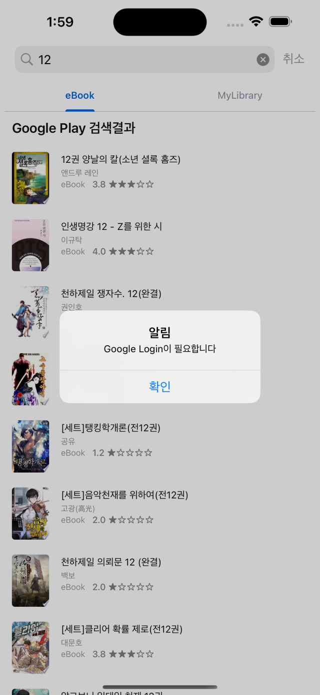
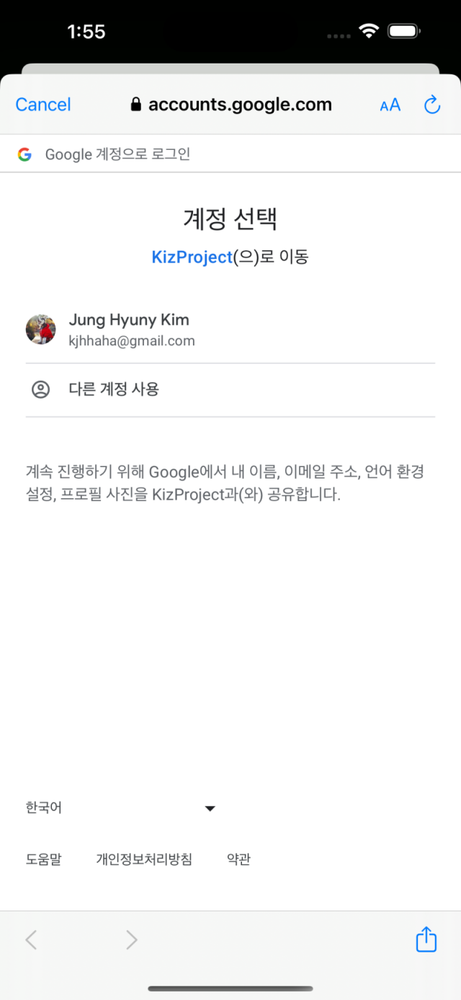
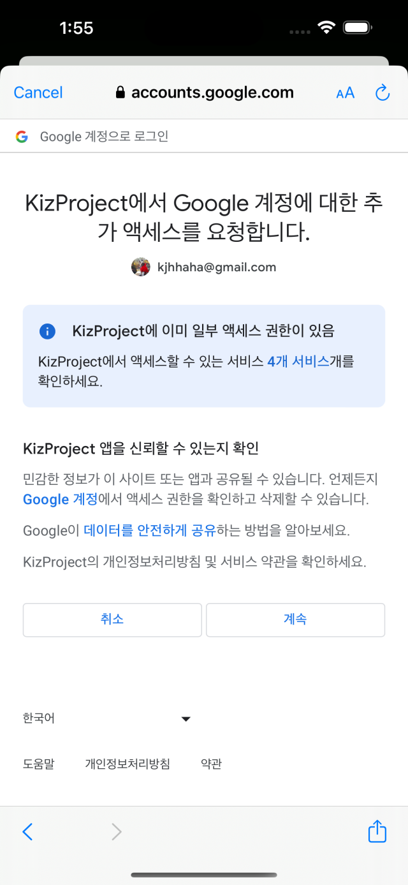
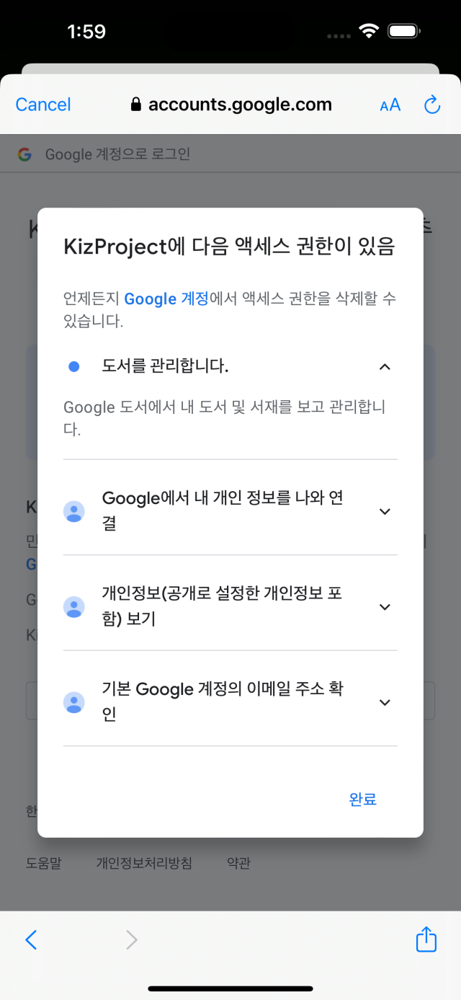
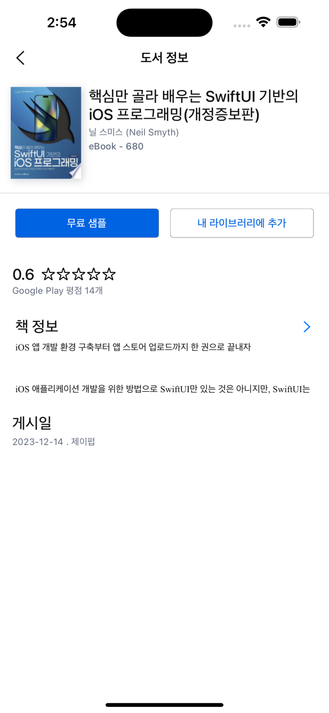
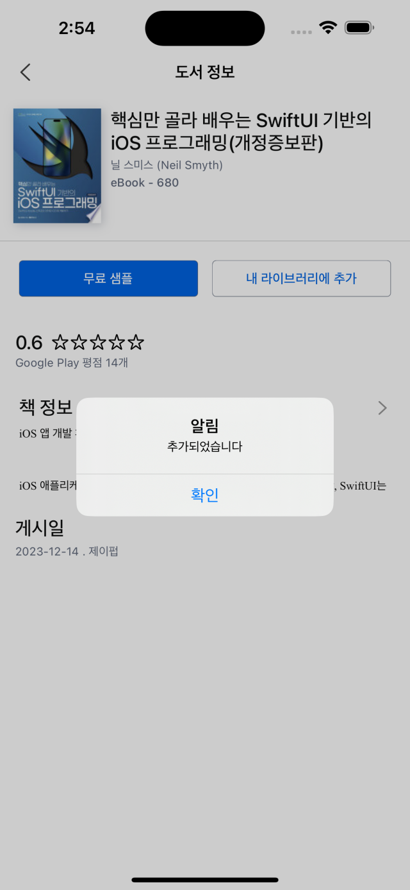
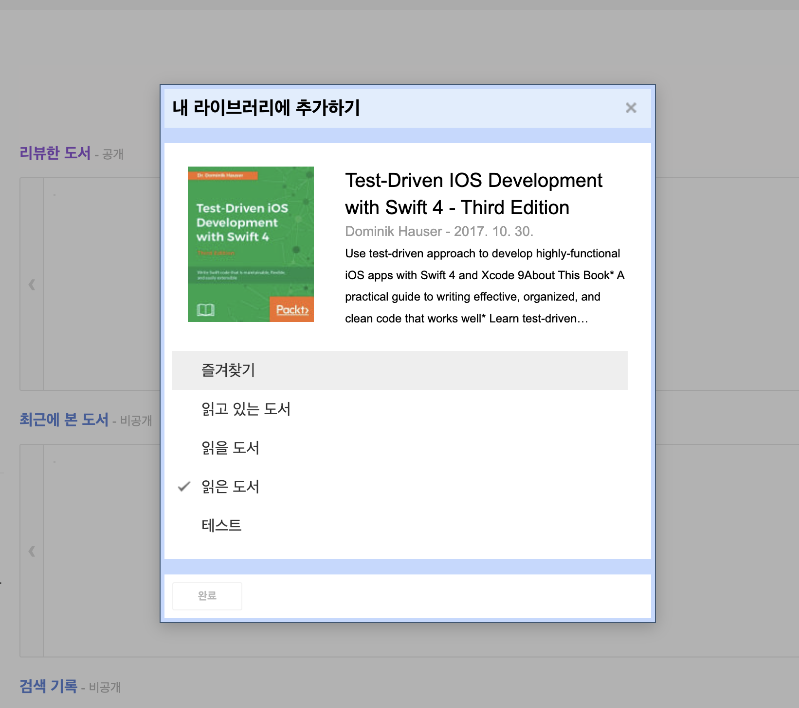

# 키즈노트 사전과제

### 사용기술
## Design pattern, Architecture
- MVVM
- CleanArchitecture

## Libraries
- SnapKit
- RxSwift
- RxCocoa
- Swinject

## 의존성관리
- Swift Package Manager

## Gitflow

## API
Search
https://www.googleapis.com/books/v1/volumes?q=swift&filter=ebooks&projection=lite

특정 볼륨
https://www.googleapis.com/books/v1/volumes/zyTCAlFPjgYC?key=yourAPIKey

나의 라이브러리
Mylibrary.bookshelves - https://www.googleapis.com/books/v1/mylibrary/bookshelves

나의 서가 Book리스트
Mylibrary.bookshelves.volumes - https://www.googleapis.com/books/v1/mylibrary/bookshelves/shelf/volumes 

서가에 Volume 추가
Mylibrary.bookshelves - https://www.googleapis.com/books/v1/mylibrary/bookshelves/shelf/addVolume

# 구글 로그인 
- 구글 로그인이 필요한 기능이 있습니다.
- 로그인시에 아래와 같은 GoogleBook 권한을 확인하는게 필요합니다
- 아직 배포된 앱이 아니기떄문에 안전하지 않은 페이지 라고 나올 수 있는데 [고급] 을 눌러서 앱으로 돌아가기를 선택해 주세요.

# 내 라이브러리에 추가
- 현재는 "To Read" 항목에 고정으로 추가 됩니다. 
- 추후 개선으로 라이브러리 리스트를 얻어서 선택하도록 만들면 좋을것 같습니다. 
- 
 

ex) 

### 2/29일
- 폴더구조/ 프로젝트 생성 / 요구사항정리
- Entity DTO 정리, Test 추가

### 3/1 
- 네트워크 레이어 생성
- 네트워크 테스트
- Use Case 정리 - UseCase Implementation까지

### 3/2
- Use Case 정리 - Repositoy - network 연결
- 의존성 정리
- Search UI Base 

## 3/3
- UI 작업 시작 스냅킷 적응
- Search UI Detail
- ImageDownloader
- ImageCache
- 버그수정

 ## 3/4 
 - 상세화면 연결
 - UI 버그 수정
- ReactorKit 도입 여부

## 3/5 
- 상세화면 UI맞추기
- 별점 뷰 만들기
- 책정보 상세 만들기

## 3/6 
- Google Login 연동
- MyLibrary List 연동
- 기타 UI 수정
- TestPlan수정

## 3/7
- 내 라이브러리에 추가하기 : 2 - To Read에 추가
- 내 서가 리스트에서 더 보기 구현
- 정리

###
 